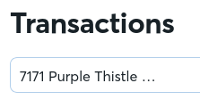
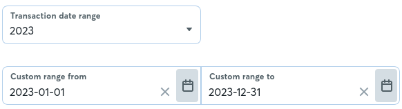
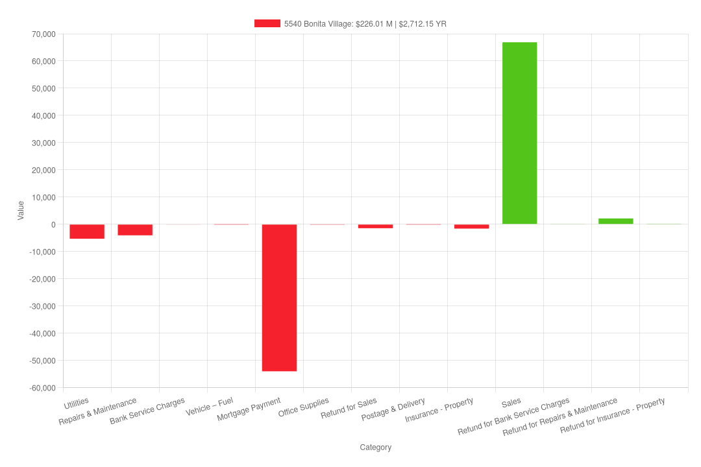
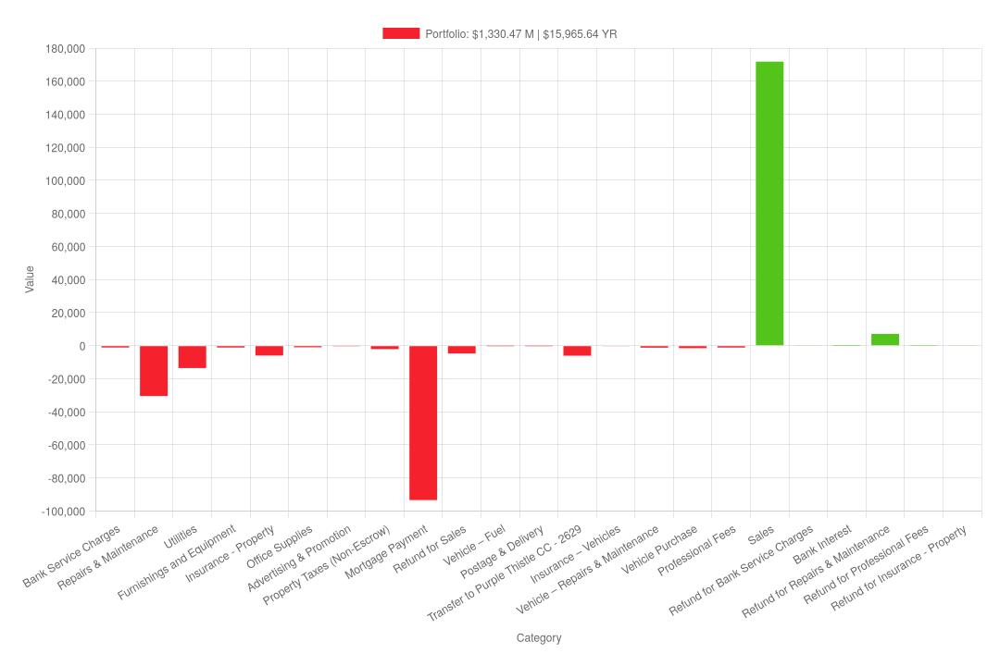
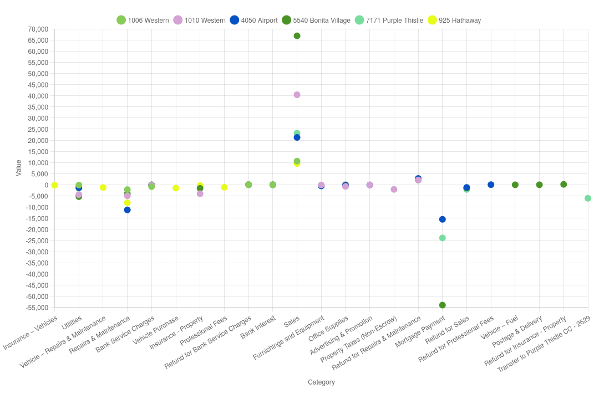

# Wave Scrape

Due to software limitations, connected accounts are only exportable in credit/debit format from the General Ledger. This repository facilitates the generation of .json, .jpg exports of connected account data by category for uses like Schedule E reporting and deeper business analytics.

## dom-scrape.js

1. Navigate to the transactions page in Wave accounting and select an account. 



2. Select filters and the desired time range, typically one year.



3. Scroll down the transactions and click "Load More" until there is no more data to request from the server and it is all loaded.


4. Copy paste the dom-scrape.js contents into the [Console](https://balsamiq.com/support/faqs/browserconsole/) in the web browser.

5. Paste this code into the console to download the data as a .json file.
```javascript
    const t = new transactionsByAccount;
    t.downloadStatement();
```


### ~/downloads/*.json -> ./data/{YEAR}/*.json -> .json output 
```json
{
    "account": "7171 Purple Thistle - 1844",
    "expense": {
        "Bank Service Charges": -81.95000000000002,
        "Utilities": -1571.8100000000002,
        "Furnishings and Equipment": -544.48,
        "Transfer to Purple Thistle CC - 2629": -6058.5700000000015,
        "Mortgage Payment": -23855.34,
        "Refund for Sales": -2087.5
    },
    "income": {
        "Refund for Bank Service Charges": 81.95000000000002,
        "Sales": 23130.48
    },
    "annual": -10987.220000000001,
    "monthly": -915.6016666666668
}
```

## node-generate.js

1. `npm run gen`

### ./output/{YEAR}/*.jpg -> jpg output 



### ./output/combined_{YEAR}.jpg -> jpg output 



### ./output/comparison_{YEAR}.jpg -> jpg output 



